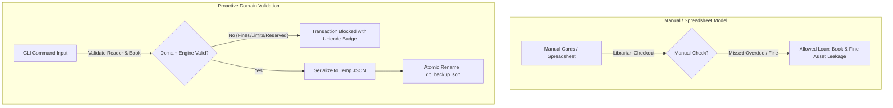

# 📋 **BiblioModel — Eliminating Physical Book Loss & Unrecovered Late Fines**

### **Lightweight, Local-First Domain Rules & Auto-Validation Library Engine**

[](https://www.python.org/)
[](https://en.wikipedia.org/wiki/Domain-driven_design)
[](https://docs.python.org/3/library/)
[](https://en.wikipedia.org/wiki/Test-driven_development)

---

## **🏛️ Repository Metadata & Context**

| Property               | Description                                                  |
| :--------------------- | :----------------------------------------------------------- |
| **Role**               | Core Repository Architecture / Domain Rules Engine           |
| **Target Segment**     | SMB Municipal & Academic Department Libraries                |
| **Architecture Style** | Clean Architecture / Domain-Driven Design (DDD)              |
| **Execution Engine**   | In-Memory Engine with Atomic JSON State Backup Serialization |
| **Date of Creation**   | June 12, 2026                                                |
| **Current Version**    | v1.0.0                                                       |

---

## **🚀 1. The Product Vision & Core Problem**

### **1.1. The Macro Pain Space**

In small and mid-sized municipal and academic libraries, operations are heavily bottlenecked by legacy paper-card ledgers and disconnected spreadsheets. These manual workarounds result in a **15% annual inventory shrinkage rate** (lost books) and a **fines recovery rate under 20%**.

Excel and manual cards allow invalid states (e.g., checkout dates in the future, bypassing borrowing limits, and missing hold lists). This blind spot introduces **Systemic State Drift** and direct capital loss through lost book assets and unrecovered late fees.

### **1.2. The BiblioModel Paradigm Shift**

BiblioModel transitions libraries to **Proactive Systemic Resilience**. Instead of relying on manual oversight, the domain engine strictly enforces status state-machines, checkout rules, and FIFO reservation queues. All operations validate patron eligibility in real time before committing changes.



To guarantee sub-millisecond execution and complete privacy, BiblioModel operates with the following operational SLA constraint: **All memory-resident checks, lookups, and domain rules evaluate in under 10ms.**

---

## **🎮 2. CLI / Interface Usage Reference**

The command-line interface is engineered for high operational speed. Use the following core execution commands:

| Command / Action | Syntax                                                                       | Description                                            | Example                                                                                    |
| :--------------- | :--------------------------------------------------------------------------- | :----------------------------------------------------- | :----------------------------------------------------------------------------------------- |
| **Start Shell**  | `python src/main.py shell`                                                   | Launches the interactive CLI prompt shell              | `python src/main.py shell`                                                                 |
| **Book Loan**    | `python src/main.py loan --reader <id> --book <id> [--date YYYY-MM-DD]`      | Registers a checkout and verifies reader eligibility   | `python src/main.py loan --reader R101 --book B202`                                        |
| **Book Return**  | `python src/main.py return --book <id> [--date YYYY-MM-DD]`                  | Processes a return and calculates late fees            | `python src/main.py return --book B202`                                                    |
| **Reserve Book** | `python src/main.py reserve --reader <id> --book <id>`                       | Places a reader in the book's FIFO reservation queue   | `python src/main.py reserve --reader R102 --book B202`                                     |
| **Waive Fine**   | `python src/main.py waive --reader <id> --operator <name> --reason <reason>` | Clears reader fines and writes an audit log trail      | `python src/main.py waive --reader R101 --operator "Jane" --reason "Damaged page settled"` |
| **Daily Report** | `python src/main.py report`                                                  | Exports a daily library status handover report         | `python src/main.py report`                                                                |
| **List Books**   | `python src/main.py list-books`                                              | Renders a table of all books and reservation queues    | `python src/main.py list-books`                                                            |
| **List Readers** | `python src/main.py list-readers`                                            | Renders a table of all registered readers and balances | `python src/main.py list-readers`                                                          |
| **List Loans**   | `python src/main.py list-loans`                                              | Renders an audit table of active and past loans        | `python src/main.py list-loans`                                                            |

> [!NOTE]
> **Data & Validation Rules:**
>
> - **Eligibility Bounds:** Readers with active overdue loans or unpaid fines are barred from starting new loans.
> - **Quantity Limit:** Readers cannot exceed the maximum borrow count (configured in `config.ini`).
> - **Dates Format:** Dates passed to the CLI must comply with the ISO 8601 `YYYY-MM-DD` format.

---

## **🛠️ 3. Technical Stack Overview**

The codebase leverages Python's standard libraries to enforce modular boundaries without external dependency overhead.

| Architectural Layer | Component / Technology      | Technical Rationale                                                |
| :------------------ | :-------------------------- | :----------------------------------------------------------------- |
| **Frontend Client** | CLI (`argparse` & `shlex`)  | Text-based terminal interface optimized for rapid operator inputs. |
| **Backend Engine**  | Pure Python 3.10+           | Strict object-oriented modeling with zero external frameworks.     |
| **In-Memory Store** | In-memory Hash Maps         | Memory-resident tables allowing $O(1)$ lookup complexity.          |
| **Persistence**     | Local JSON File Adapter     | Atomic writes utilizing `os.replace` to prevent file corruption.   |
| **Configuration**   | Configparser (`config.ini`) | Decouples parameters (fine rates, day limits) from the core code.  |

---

## **🏗️ 4. Core Architectural Premises**

To scale cleanly and maintain quality, the codebase strictly enforces Hexagonal Architecture combined with DDD boundaries:

- **Object-Oriented Domain Boundaries:** The codebase is partitioned into pure isolated domain contexts (`src/domain/`). Inter-module orchestration occurs strictly via use case interceptors, completely banning direct adapter access from domain code.
- **TDD-First Enforcement:** Every business behavior is validated by executing test specifications written under `tests/` before implementation.
- **Atomic Save Protocol:** Write operations serialize to `db_backup.tmp` first, then execute an atomic OS-level rename to replace `db_backup.json` to prevent partial-write corruption on power failures.
- **FIFO Hold Queue Design:** Popular titles block standard checkouts by maintaining reader queues when a book is in a reserved status.

---

## **📂 5. Codebase Structure & Directory Standards**

```text
BiblioModel/
├── src/                          # System codebase root directory
│   ├── domain/                   # Bounded domain context (entities, value objects, services)
│   │   ├── entities.py           # BookEntity, ReaderEntity, LoanEntity classes
│   │   └── services.py           # FineCalculator rule engine
│   │
│   ├── app/                      # Application layer (business use cases)
│   │   ├── ports.py              # Outbound interface ports (ILibraryRepository)
│   │   └── use_cases.py          # CheckoutUseCase, ReturnUseCase, ReserveUseCase
│   │
│   ├── infra/                    # Adaption layer (file systems, terminal integrations)
│   │   ├── adapters.py           # JSONPersistenceAdapter, INIConfigAdapter
│   │   └── cli.py                # argparse CLI controller implementation
│   │
│   └── main.py                   # Unified CLI application entrypoint bootstrap
├── tests/                        # Validation suite directory
│   ├── test_domain.py            # Unit tests validating rules and domain entities
│   ├── test_use_cases.py         # Integration tests validating use case flows
│   └── test_persistence.py       # Persistence tests (atomic writes & self-healing)
├── pyproject.toml                # Standard setuptools configuration file
├── config.ini                    # Core parameter configurations (fine daily rates, limits)
└── README.md                     # Initial setup instructions and documentation
```

---

## **💻 6. Local Engineering Development Setup**

### **6.1. Core System Prerequisites**

- Python 3.10+
- Standard virtual environment utilities (`venv`)

### **6.2. Initial Bootstrap Sequence**

1. Clone this repository locally:

   ```bash
   git clone https://github.com/KalyelNLaurindo/BiblioModel.git
   cd BiblioModel
   ```

2. (Optional) Create and activate a clean virtual environment:

   ```bash
   python -m venv .venv
   # Windows:
   .venv\Scripts\activate
   # Linux/macOS:
   source .venv/bin/activate
   ```

3. Install development dependencies (testing & linters):

   ```bash
   pip install -e .[dev]
   ```

4. Launch the interactive CLI shell:
   ```bash
   python src/main.py shell
   ```

### **6.3. Automated Verification Commands**

Ensure your modifications pass the repository quality gates before submitting a Pull Request:

- **Execute backend test suite**:

  ```bash
  pytest
  ```

- **Verify codebase static type alignments**:

  ```bash
  mypy src
  ```

- **Verify code style conventions**:
  ```bash
  flake8 src
  ```

---

## **🔮 7. Future Features Planning**

To extend BiblioModel's capabilities for larger installations, the following roadmap features are planned:

1. **SQL Database Adapter**: Transition from local JSON serialization to an SQLite/PostgreSQL concrete repository implementing the outbound `ILibraryRepository` port, enabling concurrent client-server write access.
2. **Web API Layer**: Package the use cases under a FastAPI/Flask HTTP gateway, exposing RESTful endpoints for remote catalog integration.
3. **Librarian Notification Alerts**: Integrate an automated notification system that parses overdue loans daily and fires automated billing/warning messages (SMTP/SMS) to suspended readers.
4. **Bulk CSV Importer**: Develop a bootstrap command tool capable of bulk importing thousands of reader and book entities from Excel spreadsheets.

---

🏁 **End of Document:** This repository README serves as the definitive engineering portal for the BiblioModel library. Changes to config parameters, schemas, or installation requirements must follow standard pull-request governance.

Made with ❤️ by **Kalyel Nunes Laurindo | Software Engineer**
