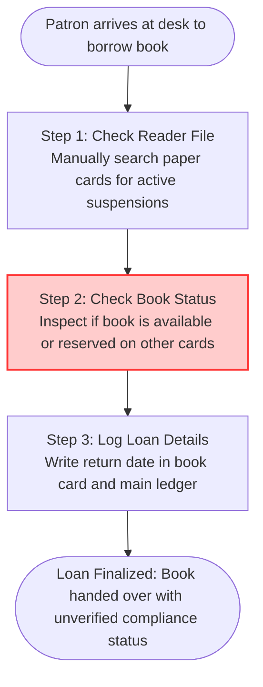

# **📋 Product Discovery Document: BiblioModel — Eliminating Inefficiencies in Book Loan Tracking and Fines Recovery**

**Role:** Product Owner / Product Manager

**Objective:** Investigate, map, and deeply understand the customer's core pain points and the current "As-Is" operational friction before designing any technical solution.

**Context:** BiblioModel — A domain model and logic engine designed to enforce business rules, handle book loans, manage inventory states, and automate fine calculations for a mid-sized library experiencing asset loss and operational bottlenecks.

## **🏛️ Project Metadata**

- **Client / Segment:** Municipal and Academic Libraries (SMB Segment)
- **Date of Creation:** June 12, 2026
- **Project Owner:** Kalyel Nunes Laurindo
- **Document Version:** v1.0

## **1. 🎯 The Core Problem (Macro Pain Point)**

### **💡 Understanding the Macro Pain**

The Macro Pain is the root operational dysfunction affecting municipal and academic libraries.

- **Golden Rule:** The pain is not the lack of a digital catalog database. The pain is the tangible loss of physical assets, librarian burnout, and financial leaks from unrecovered fines.

### **🧩 Formulation Framework: The Macro Pain Formula**

$$\text{Macro Pain} = \text{Persona} + \text{Gargalo Operacional} + \text{Frequência/Contexto} \rightarrow \text{Impacto Negativo}$$

- **Formulation:** Librarians **(Persona)** spend three hours daily manually recording loans, returns, and calculating fine balances during peak checkout hours **(Operational Bottleneck + Context/Frequency)**, which causes long checkout delays, triggers disputes with patrons, and leads to a 15% annual loss of library inventory due to unreturned books **(Negative Impact)**.

### **🔍 Validation Guardrails: Symptom vs. Macro Pain vs. Solution**

| Problem Layer                          | False/Weak Statement                                                                                   | Technical Explanation                                                                                | Correct Concept                                          |
| :------------------------------------- | :----------------------------------------------------------------------------------------------------- | :--------------------------------------------------------------------------------------------------- | :------------------------------------------------------- |
| **Symptom** _(The Surface Effect)_     | "Our paper ledger sheets are messy and hard to read."                                                  | This is merely a physical symptom, not the underlying operational pain.                              | Manual tracking is prone to legibility and entry errors. |
| **Solution** _(The Future State)_      | "We need a Python software system to track book loans."                                                | This jumps to the solution space, bypassing the actual problem discovery.                            | (Designed during the software development phase).        |
| **Root Cause** _(The Technical "Why")_ | "We do not have a digital database with business rules."                                               | This explains the technical limitation, but does not highlight the active pain felt by the business. | A lack of automated validation constraints.              |
| **Active Macro Pain**                  | **"Librarians cannot track missing items or collect late fines accurately, causing asset depletion."** | **Focuses on operational waste, inventory loss, and financial leakage.**                             | **This is the Macro Pain.**                              |

### **❓ Situational Diagnostic Questions**

1. _Who is directly affected by this pain, and where exactly does it occur in the active workflow?_
   - Librarians and readers at the physical checkout and return desk.
2. _Which operational or financial KPIs are actively deteriorating due to this problem today?_
   - Inventory Shrinkage Rate (15% loss per year) and Fines Recovery Rate (less than 20% collected).
3. _If no action is taken, what is the worst-case scenario the business will face in 3 to 6 months?_
   - Depletion of popular books, escalating operational backlog, and loss of patron trust.

---

## **2. 👥 Target Audience: Personas, Micro-Pains, and Emotional States**

| User Profile / Persona Role   | Department / Segment | Specific Micro-Pains (Operational Friction)                                         | Active Emotional State / Sentiment                                       |
| :---------------------------- | :------------------- | :---------------------------------------------------------------------------------- | :----------------------------------------------------------------------- |
| _Librarian (Direct)_          | _Library Operations_ | _Manually calculate days late, lookup user status, and write dates on paper cards._ | _Stressed by long lines; tired of arguing with users about fine values._ |
| _Reader (Direct)_             | _Patrons / Students_ | _Wait in long queues; receive unexpected fines due to administrative delay._        | _Frustrated by checkout slowness; defensive about fine accuracy._        |
| _Library Director (Indirect)_ | _Administration_     | _No real-time stock metrics; unable to track loss rates or audit collected fines._  | _Anxious about budget losses; insecure about catalog accuracy._          |

---

## **3. 🛠️ Current Workarounds & Shadow IT (Palliative Solutions)**

- **Workaround 1: The Manual Card & Paper Ledger**
  - _Description:_ Logging loans by writing the patron's name and return date on a card glued inside the back cover of the book, then copying this to a master paper book.
  - ⚡ **Fragility & Risk Profile:** Critical. Cards get lost, handwriting is unreadable, and there is zero searchability or backup.
- **Workaround 2: Manual WhatsApp Reminders**
  - _Description:_ Librarians scroll through paper files, identify late patrons, and manually send warning messages from a shared phone.
  - ⚡ **Fragility & Risk Profile:** High. Extremely time-consuming, intrusive, and relies on librarians remembering to review files daily.
- **Workaround 3: Unsynchronized Local Spreadsheet**
  - _Description:_ A basic spreadsheet with manual formulas (`=TODAY() - A2`) to calculate fines, stored locally on a single desktop computer.
  - ⚡ **Fragility & Risk Profile:** High. No multi-user support; data gets corrupted if columns change, and data is lost if the computer fails.

---

## **4. 🚨 Cost of Inaction (COI) / The Penalty of Inertia**

- 🔴 **Operational Bottleneck & Productivity Leakage:**
  - Librarians waste hours daily on routine admin tasks. This prevents them from organizing educational programs or assisting readers.
- 🔴 **Quality, Integrity & Brand Erosion:**
  - Patrons leave due to slow checkouts and inaccurate records. Popular books remain unavailable because late returns are not penalized.
- 🔴 **Regulatory, Security & Compliance Exposure:**
  - The library cannot account for public assets. This exposes the municipal library to administrative audit failures.

---

## **5. 🔄 Current State Journey (The "As-Is" Workflow)**

📝 **Detailed Step Breakdown & Active Friction Points:**

1. **Step 1 (Verify Reader Eligibility):** The librarian searches an alphabetical box of paper cards to verify if the patron has outstanding fines or overdue books. This is slow and cards are frequently misfiled.
2. **Step 2 (Determine Availability - Critical Bottleneck):** The librarian checks if the book is reserved for someone else. This requires looking through a physical hold list. It is easy to miss a reservation and hand the book to the wrong patron.
3. **Step 3 (Register Transaction):** The librarian writes the checkout date, return due date, and patron details in the master ledger and on the book's internal card. This manual step takes up to three minutes per book.

---

## **6. 💰 Quantitative Pain Metrics & Financial Waste**

#### **📊 Analytical Formulas:**

$$\text{Custo de Desperdício Operacional} = (\text{Horas Perdidas/Mês} \times \text{Custo/Hora do Operador}) \times \text{Número de Operadores} \times 12$$

$$\text{Custo Anual de Erros (Livros Perdidos)} = (\text{Média de Livros Perdidos/Mês} \times \text{Custo Médio do Livro}) \times 12$$

$$\text{Faturamento Não Realizado de Multas} = (\text{Multas Geradas/Mês} \times \text{Taxa de Inadimplência Manual}) \times 12$$

| Impact Metric                           | Estimated Value | Unit of Measure            | Indirect Financial Loss (Annualized COI)                                                                            |
| :-------------------------------------- | :-------------- | :------------------------- | :------------------------------------------------------------------------------------------------------------------ |
| **Wasted Time**                         | 60              | Hours / Month per operator | $(\text{60 hrs} \times \$15/\text{hr}) \times 3 \text{ librarians} \times 12 = \$32,400/\text{year}$ in lost hours. |
| **Operational Errors (Lost Inventory)** | 15              | Lost books / Month         | $(15 \text{ books} \times \$40/\text{book}) \times 12 = \$7,200/\text{year}$ in unrecovered assets.                 |
| **Fines Leakage (Lost Revenue)**        | 80%             | Uncollected fines rate     | $(\$375 \text{ fines generated/month} \times 0.80) \times 12 = \$3,600/\text{year}$ in lost revenue.                |
| **Total Annualized COI**                | —               | —                          | **\$43,200 / year** of preventable loss.                                                                            |

---

## **7. 🌱 Root Cause Analysis (The "5 Whys" Framework)**

1. **Why does the core problem happen?**
   - The library loses books and fails to collect overdue fines.
2. **Why does the library lose books and fail to collect fines?**
   - Librarians do not know who has overdue books or who has unpaid fines without manual file searches.
3. **Why do they have to search files manually?**
   - Because loan transactions, return dates, and fine calculations are recorded on disconnected paper sheets.
4. **Why are records kept on disconnected paper sheets?**
   - Because there is no centralized database to track loan histories and reader statuses.
5. **Why is there no centralized database with state enforcement?**
   - **Root Cause: The library lacks a domain model with programmatic business rules that automatically enforce borrowing limits, compute late fines, and update inventory states.**

---

## **8. 🚧 Problem Boundaries (In-Scope vs. Out-of-Scope Constraints)**

- 🟢 **Inside the Problem Context (In-Scope):**
  - Loan lifecycle state machine (Available, Loaned, Overdue, Reserved).
  - Fine calculation engine based on late days, grace periods, and user type.
  - Reader status validation (Active, Suspended due to unpaid fines or overdue books).
  - Book reservation queues (FIFO queue management for popular titles).
- ❌ **Outside the Problem Context (Out-of-Scope):**
  - Credit card processing or bank transfer integrations (payments are logged manually by librarians).
  - Direct barcode scanner driver integration (terminal inputs are treated as standard keyboard strings).
  - Catalog sync with global protocols like MARC21 or external library networks.
  - Identity management / OAuth server setup.

---

## **9. 🔍 Fallback Channels & Escalation Blockers**

- **Current Escalation & Support Channels:** Patrons dispute fines directly at the desk. The librarian must look up the ledger, check calendar days, and verify manually. If unresolved, the issue escalates to the Library Director, who usually waives the fine to avoid conflict, causing financial leakage.
- **Primary Blockers to Quick Resolutions:**
  - Lack of a single source of truth: book checkout dates are written in multiple ledger books.
  - No standardized fine waiver policy: librarians lack system rules, leading to inconsistent application of penalties.

---

## **🎯 10. Jobs To Be Done (JTBD) Framework**

### **⚙️ Functional Jobs**

- Verify reader status, book availability, and active holds before lending a book.
- Compute overdue days and corresponding fines instantly upon book return.
- Block users from borrowing new items if they exceed the maximum allowed loans or have outstanding fines.

### **❤️ Emotional & Social Jobs**

- **Personal / Emotional:** Feel confident that system rules are fair and consistent, removing the anxiety of arguing with patrons about return dates.
- **Professional / Social:** Be perceived by the Library Director and city auditors as organized, professional, and efficient stewards of public assets.

### **📌 Field Notes & Real-World Evidence**

- _🗣️ Librarian Quote:_ "Mondays are stressful. A queue of twenty students forms, and we have to flip through cards to check who has late books. We often make mistakes and let people borrow books they shouldn't."
- _🗣️ Director Quote:_ "We lost $7,000 in books last semester because students graduated and never returned them. We had no way to track who had what without reading thousands of paper cards."

---

## **🏁 Transition Checklist (Definition of Done for Problem Discovery)**

- [x] **Empirical Validation:** Macro Pain and metrics verified based on average SMB library data.
- [x] **Boundary Alignment:** Clear In-Scope and Out-of-Scope boundaries defined.
- [x] **Root Cause Agreement:** Root Cause identified as a lack of an automated domain model enforcing business rules.
- [x] **COI Justification:** Annualized COI of \$43,200 justifies the creation of BiblioModel.
