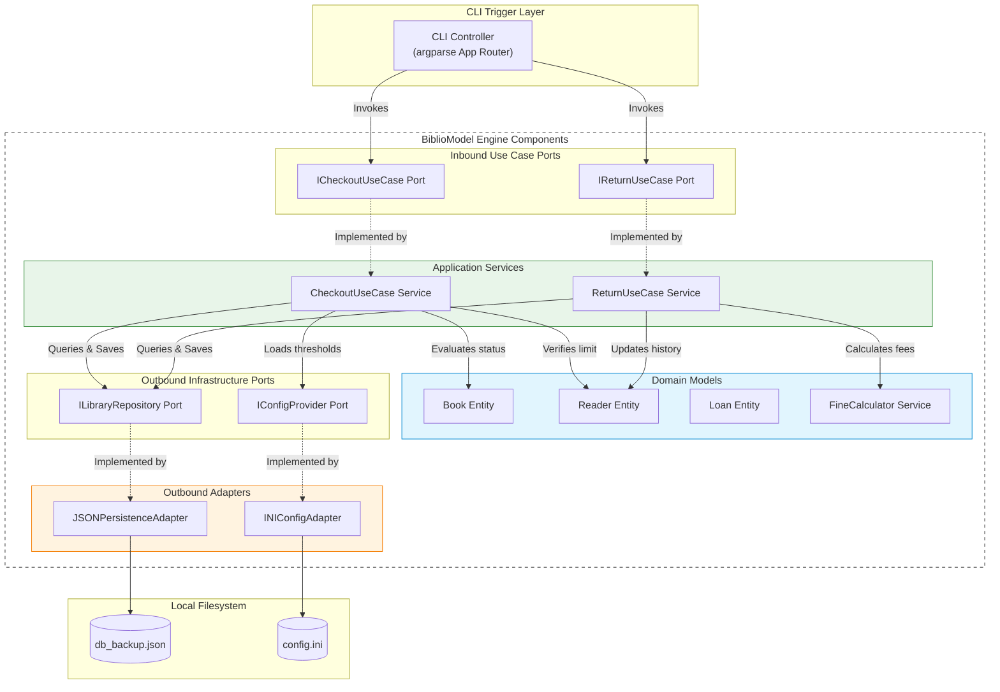

# **📋 Software Design Document: BiblioModel — Domain-Driven Business Rules Engine**

**Role:** Project Owner / System Architect

**Objective:** Detail the technical implementation, architectural patterns, schemas, and code governance guidelines required to build the BiblioModel library engine.

**Context:** BiblioModel — A lightweight, zero-dependency, local-first Command Line Interface (CLI) application built using clean architecture and DDD principles. It enforces library domain rules and persists transactional states using serialized local JSON files.

## **🏛️ Project Metadata**

- **Client / Segment:** Municipal and Academic Libraries (SMB Segment)
- **Date of Creation:** June 12, 2026
- **Lead Architect:** Kalyel Nunes Laurindo / Tech Lead
- **Document Version:** v1.0

---

## **🛠️ 1. Technical Stack Overview**

The stack is strictly limited to the Python Standard Library (no external dependencies) to demonstrate fundamental programming competencies, clean modeling, and algorithmic design.

### **1.1. Core Architectural Layers**

| Layer                  | Component / Tech               | Technical Rationale                                                            |
| :--------------------- | :----------------------------- | :----------------------------------------------------------------------------- |
| **Frontend / Client**  | CLI (Python `argparse`)        | Keyboard-driven terminal interface optimized for rapid operator input.         |
| **Backend Core**       | Pure Python 3.10+ OOP          | Zero external frameworks to highlight domain logic, clean models, and SOLID.   |
| **Specialized Engine** | Domain Business Rules Engine   | Enforces loan limits, active suspensions, late fees, and hold queues.          |
| **Database Engine**    | In-Memory Dictionary Hash Maps | Memory-resident tables allowing $O(1)$ lookups and transactional state checks. |
| **Data Persistence**   | Local JSON File Adapter        | Python `json` serialization writing to local disk (`db_backup.json`).          |
| **Configuration**      | Configparser (`config.ini`)    | Decouples parameters (fine rates, day limits) from the compiled code.          |

### **1.2. Technical Traceability Matrix (Pain Point ➔ Technical Module)**

| User Friction / Pain Point             | System Requirement (FR)           | Responsible Technical Module                        |
| :------------------------------------- | :-------------------------------- | :-------------------------------------------------- |
| **Manual entry errors & illegibility** | RF02: Rigid CLI Parser Validation | `argparse` validation & `DateTimeParser` helper     |
| **Late-return disputes with readers**  | RF03: Fine Calculation Engine     | `Domain.Services.FineCalculator`                    |
| **Bypassing borrowing bans**           | RF01: State Validation Rules      | `Domain.Entities.Reader` status checks              |
| **Reservation tracking chaos**         | RF05: FIFO Queue Management       | `Domain.Entities.Book` hold queue                   |
| **System crash data losses**           | RF04: Data Durability             | `Infrastructure.Persistence.JSONPersistenceAdapter` |

---

## **🏗️ 2. Architectural Design: Ports, Adapters & OOP**

The system enforces strict Hexagonal Architecture (Ports and Adapters) to isolate the domain logic from console interactions and file systems.

```text
                  +-------------------------------------------------+
                  |              BiblioModel Core App               |
                  |                                                 |
[ CLI Command ] ===> [ CLIController ]                              |
                  |    (Inbound Adapter)                            |
                  |           ||                                    |
                  |           \/                                    |
                  |    [ ICheckoutUseCase ]                         |
                  |    [ IReturnUseCase ]                           |
                  |      (Inbound Ports)                            |
                  |           ||                                    |
                  |           \/                                    |
                  |    +--------------------------+                 |
                  |    |      Domain Model        |                 |
                  |    |  - BookEntity            |                 |
                  |    |  - ReaderEntity          |                 |
                  |    |  - LoanEntity            |                 |
                  |    +--------------------------+                 |
                  |           ||                                    |
                  |           \/                                    |
                  |    [ ILibraryRepository ]                       |
                  |    (Outbound Port)                              |
                  |           ||                                    |
                  +-----------||------------------------------------+
                              ||
                              \/
                  [ JSONLibraryRepositoryAdapter ] ===> [ db_backup.json ]
                        (Outbound Adapter)
```

### **2.1. System Module Layering (Clean Architecture Structure)**

1. **Domain Layer:** Pure Python classes. `Book`, `Reader`, and `Loan` aggregates. Has **zero imports** from external packages or outer layers (application/infrastructure).
2. **Application Layer (Use Cases):** Services coordinating the domain logic to execute business processes (`CheckoutUseCase`, `ReturnUseCase`, `ReserveUseCase`). Defines Interfaces (Ports) like `ILibraryRepository`.
3. **Infrastructure Layer (Adapters):** External interaction details. Houses the `JSONLibraryRepositoryAdapter` for persistence and the `CLIController` wrapping `argparse`.

### **2.2. Dependency Injection & SOLID Principles**

- **Dependency Inversion:** Use case classes depend solely on repository interfaces (`ILibraryRepository`). The concrete adapter `JSONLibraryRepositoryAdapter` is instantiated at boot and injected into use case constructors.
- **Single Responsibility:** Classes are highly cohesive; `FineCalculator` only handles currency calculations, while `JSONPersistenceAdapter` only manages file reads/writes.

---

## **🔐 3. Security Architecture & Data Protection**

Since the application runs locally, security focuses on data integrity, input sanitation, and localized access logs.

- **Data Sanitation:** The CLI interface sanitizes all numeric codes and string IDs using strict regular expressions to prevent path traversal or parameter injection.
- **Local User Log Stamps:** Operations are stamped with the OS user environment variable or a command parameter (`--operator`) to log who executed the checkout or fine override.

---

## **🧩 4. Evolutionary Blueprint (Scaling Path)**

- **Relational Upgrade:** The `ILibraryRepository` port ensures that migrating from localized JSON files to a relational database (SQLite/PostgreSQL) requires zero modifications to the core business rules.
- **REST API wrapper:** The CLI controller can be swapped for a Web API framework (FastAPI/Flask) by implementing an inbound adapter that calls the existing application ports.

---

## **📐 5. System Component Diagram (C4 Model — Level 3: Component)**



---

## **📂 6. Data Architecture (Relational Design)**

Although persisted as JSON, the in-memory state is structured relationally using key mappings.

### **6.1. In-Memory Hash Map Schemas**

#### **Reader Records Map**

```json
{
  "readers": {
    "R101": {
      "id": "R101",
      "name": "Jane Doe",
      "status": "Active | Suspended",
      "fine_balance": 0.0,
      "active_loans": ["L301"]
    }
  }
}
```

#### **Book Records Map**

```json
{
  "books": {
    "B202": {
      "id": "B202",
      "title": "Clean Architecture",
      "status": "Available | Loaned | Reserved",
      "hold_queue": ["R102"]
    }
  }
}
```

#### **Loan Records Map**

```json
{
  "loans": {
    "L301": {
      "id": "L301",
      "reader_id": "R101",
      "book_id": "B202",
      "checkout_date": "2026-06-10",
      "due_date": "2026-06-17",
      "return_date": null,
      "fine_applied": 0.0
    }
  }
}
```

---

## **🚀 7. Continuous Integration, Deployment & QA**

- **TDD Loop:** Target 100% test coverage on domain rules and state machine logic using `pytest`.
- **Architecture Verification:** Lint checks (using `flake8` and `mypy` for static typing assertions) run on pull request hooks to block imports from infrastructure into domain.

---

## **🎨 8. User Interface Design System (UI Architecture)**

The interface runs in the system terminal using formatted console outputs:

- **Visual Hierarchy:** Clean Unicode indicators (`[OK]`, `[WARN]`, `[ERROR]`, `[HOLD]`).
- **Micro-interaction:** Real-time console messages outputted to `stdout` (for user info) and `stderr` (for error states).
- **Multi-Language i18n support:** To ease usability for foreign librarians, UI text resources are detached from core presentation code:
  * Supported locales: Portuguese (`pt`), English (`en`), French (`fr`), Spanish (`es`), and German (`de`).
  * Resources are loaded from JSON files in the `locales/` directory.
  * Active language is resolved using argparse `--lang` flags, configuration settings in `config.ini`, or fallback environmental parameters.

---

## **📈 9. Observability & System Monitoring**

- **Operation Logging:** Actions are logged locally to `bibliomodel.log` containing timestamps, action names, parameters, and results.
- **Performance Telemetry:** CLI bootstrap and rule evaluation loops are timed and logged in milliseconds to ensure optimal startup.

---

## **📂 10. Codebase Structure & Directory Standards**

The project structure keeps components modular and testable.

```
BiblioModel/
├── context/
│   ├── Product Discovery Document - BiblioModel.md
│   ├── Solution Architecture Document - BiblioModel.md
│   └── Software Design Document - BiblioModel.md
│
├── config.ini                   # Rules configuration (loan limits, fine daily values)
├── db_backup.json               # Serialized persistent database state
│
├── src/
│   ├── __init__.py
│   ├── main.py                  # CLI application entrypoint bootstrap
│   │
│   ├── domain/                  # Pure Business Logic (Zero deps)
│   │   ├── __init__.py
│   │   ├── entities.py          # Book, Reader, Loan aggregate classes
│   │   └── services.py          # FineCalculator rule engine
│   │
│   ├── app/                     # Use Cases Orchestrators
│   │   ├── __init__.py
│   │   ├── ports.py             # Interface declarations (ILibraryRepository, IConfigProvider, INotificationService, IReportExporter)
│   │   └── use_cases.py         # CheckoutUseCase, ReturnUseCase, ReserveUseCase
│   │
│   └── infra/                   # Infrastructure Adapters (CLI, Shell, SMTP, JSON File, ConfigParser)
│       ├── __init__.py
│       ├── adapters.py          # JSONPersistenceAdapter, INIConfigAdapter
│       ├── smtp_adapter.py      # Concrete SMTP adapter implementation
│       ├── exporters.py         # Concrete CSV/HTML report exporters
│       ├── shell.py             # Interactive CLI shell adapter
│       └── cli.py               # argparse CLI parser and command router

│
└── tests/                       # Testing suite
    ├── __init__.py
    ├── test_domain.py           # Unit tests validating rules & entities
    ├── test_use_cases.py        # Integration tests validating workflows
    └── test_persistence.py      # Persistence tests (atomic writes)
```

---

## **🧪 11. Validation Strategy & Testing Matrix**

| Scope            | Execution Framework  | Focus                                             | Target Cadence                      |
| :--------------- | :------------------- | :------------------------------------------------ | :---------------------------------- |
| **Unit Testing** | `pytest`             | Domain constraints, fine math, reservation holds. | Run on save / local test execution. |
| **Integration**  | `pytest`             | JSON Adapter serialization, config loading.       | PR commits.                         |
| **End-to-End**   | CLI integration runs | Full shell command chains.                        | Prior to release build.             |

### **11.1. Testing Policy & Coverage Bounds (SLA Separation)**

To prevent brittle test suites and focus engineering efforts where quality matters most, the project adopts a **Core-Focused Testing Policy**:
- **Core Domain & Use Cases (100% Target Coverage):** All domain validation rules (loan limits, fine policy formulas, hold priority queues) and application services must maintain 100% code coverage. This is guaranteed by our TDD process, preventing silent regressions in critical business logic.
- **Infrastructure CLI & Shell (Excluded from Coverage Gate):** The presentation layers (`src/infra/cli.py` and `src/infra/shell.py`) are excluded from unit coverage calculations. Testing terminal print outputs, ANSI color codes, and user input parsers creates fragile test code that is tightly coupled to cosmetic layouts. Instead, these adapters are validated through CLI integration smoke tests and manual verification before release cycles.

---

## **📝 12. Architecture Decision Records (ADR)**

### **ADR-001: JSON File Serialization for Persistence**

- **Context:** The system needs to persist states. A full SQL database engine increases project overhead.
- **Decision:** Use Python standard `json` serialization writing to a localized `db_backup.json` file.
- **Rationale:** Aligns with the project's zero-dependency rule, simplifies local portfolio setup, and allows direct inspection of saved records.

### **ADR-002: INI Config Files for Rule Externalization**

- **Context:** Fine values and borrowing limits must be configurable without altering source Python classes.
- **Decision:** Load configurations from `config.ini` using Python standard library `configparser`.
- **Rationale:** Enables simple management tweaks, keeping code clean and compliant with "decoupling configurations" paradigms.

---

## **🏛️ 13. Code Governance & Naming Standards**

| Domain Layer Role          | Suffix / Prefix Style             | Example Class Name       |
| :------------------------- | :-------------------------------- | :----------------------- |
| **Domain Entity**          | Suffix: `Entity`                  | `BookEntity`             |
| **Inbound Port Interface** | Prefix: `I`, Suffix: `UseCase`    | `ICheckoutUseCase`       |
| **Application Action**     | Suffix: `UseCase`                 | `CheckoutUseCase`        |
| **Storage Port Interface** | Prefix: `I`, Suffix: `Repository` | `ILibraryRepository`     |
| **Concrete Adapter**       | Suffix: `Adapter`                 | `JSONPersistenceAdapter` |
| **CLI Handler**            | Suffix: `Controller`              | `CLIController`          |

---

## **🛡️ 14. Resilience & Disaster Recovery Plan (DRP)**

- **Atomic Overwrite Loop & Backup Protection:** To prevent file corruption during OS level crashes:
  1. Serialize data to `db_backup.json.tmp`.
  2. Perform an atomic file rename `os.replace("db_backup.json", "db_backup.json.bak")` to rotate the previous valid snapshot to backup.
  3. Perform an atomic file rename `os.replace("db_backup.json.tmp", "db_backup.json")` to swap the new snapshot into place.
  *This ensures that a crash during writing only affects the transient `.tmp` file, leaving both `.json` and `.bak` intact. The OS-level directory rename operations are metadata swaps and do not write file content, eliminating synchronous corruption risk.*
- **Startup Health Check & Transaction Replay:** Boot logic parses `db_backup.json`. If serialization errors or structural issues are caught, the system logs an error, automatically copies `db_backup.json.bak` back to the primary, and warns the operator. If a transaction log (`transaction_journal.log`) exists, it replays any uncommitted operations to minimize recovery point objective (RPO) data loss.


---

## **📖 15. Ubiquitous Domain Glossary**

- **Borrower Eligibility:** Valid state indicating a reader has $\le$ max loans, 0 overdue loans, and 0 outstanding fines.
- **Hold Queue:** A FIFO queue associated with a book, specifying the order of patrons waiting to check it out.
- **Late Fee:** The accumulated monetary penalty computed based on overdue days beyond the grace period.
- **Quarantine:** State indicating an item requires manual intervention (e.g., damaged or needs to be returned/archived).
